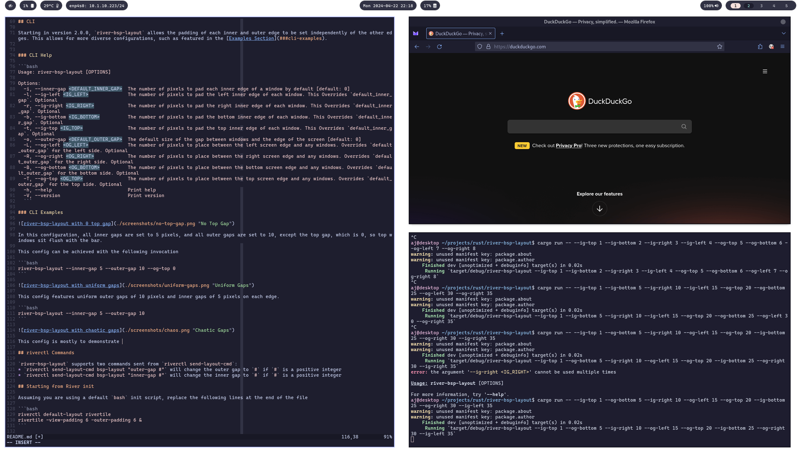

# river-bsp-layout

[](https://docs.rs/river-bsp-layout)
[](https://crates.io/crates/river-bsp-layout)


Custom River layout manager that creates a Binary Space Partition / Grid layout using `river-layout-toolkit`

3 Window Example:
```
+----------------+----------------+
|                |                |
|                |                |
|                +----------------+
|                |                |
|                |                |
+----------------+----------------+
```

4 Window Example:
```
+----------------+----------------+
|                |                |
|                |                |
+----------------+----------------+
|                |                |
|                |                |
+----------------+----------------+
```

## Installing 

### Fedora 

```bash 
dnf copr enable areif-dev/river-bsp-layout
```

```bash 
dnf install river-bsp-layout
```

### Other - Cargo 

```bash
cargo install river-bsp-layout --locked
```

## Building

* Make sure you have `cargo` installed. The recommended means of installation is with `rustup.sh` from https://www.rust-lang.org/tools/install
* Clone this repo with 

```bash
git clone https://github.com/areif-dev/river-bsp-layout
```

* Enter the cloned directory 

```bash
cd river-bsp-layout
```

* run 

```bash
cargo build --release
```

* Move the compiled binary from `target/release/river-bsp-layout` to any directory in your `$PATH`
  * With `cargo` installed, one option would be to move the the binary to `$HOME/.cargo/bin`

## CLI

Starting in version 2.0.0, `river-bsp-layout` allows the padding of each inner and outer edge to be set independently of the other edges. This allows for more diverse configurations, such as featured in the [Examples Section](###cli-examples).


### CLI Help

```bash
Usage: river-bsp-layout [OPTIONS]

Options:
  -i, --inner-gap <DEFAULT_INNER_GAP>  The number of pixels to pad each inner edge of a window by default [default: 0]
  -l, --ig-left <IG_LEFT>              The number of pixels to pad the left inner edge of each window. This Overrides `default_inner_gap`. Optional
  -r, --ig-right <IG_RIGHT>            The number of pixels to pad the right inner edge of each window. This Overrides `default_inner_gap`. Optional
  -b, --ig-bottom <IG_BOTTOM>          The number of pixels to pad the bottom inner edge of each window. This Overrides `default_inner_gap`. Optional
  -t, --ig-top <IG_TOP>                The number of pixels to pad the top inner edge of each window. This Overrides `default_inner_gap`. Optional
  -o, --outer-gap <DEFAULT_OUTER_GAP>  The default size of the gap between windows and the edge of the screen [default: 0]
  -L, --og-left <OG_LEFT>              The number of pixels to place between the left screen edge and any windows. Overrides `default_outer_gap` for the left side. Optional
  -R, --og-right <OG_RIGHT>            The number of pixels to place between the right screen edge and any windows. Overrides `default_outer_gap` for the right side. Optional
  -B, --og-bottom <OG_BOTTOM>          The number of pixels to place between the bottom screen edge and any windows. Overrides `default_outer_gap` for the bottom side. Optional
  -T, --og-top <OG_TOP>                The number of pixels to place between the top screen edge and any windows. Overrides `default_outer_gap` for the top side. Optional
  -h, --help                           Print help
  -V, --version                        Print version
  ```

### CLI Examples


In this configuration, all inner gaps are set to 5 pixels, and all outer gaps are set to 10, except the top gap, which is 0, so top windows sit flush with the bar. 

This config can be achieved with the following invocation

```bash 
river-bsp-layout --inner-gap 5 --outer-gap 10 --og-top 0
```


This config features uniform outer gaps of 10 pixels and inner gaps of 5 pixels on each edge. 

```bash 
river-bsp-layout --inner-gap 5 --outer-gap 10
```



This config is mostly to demonstrate the possibilities of individually configurable edge gaps. 

```bash 
river-bsp-layout --ig-top 1 --og-bottom 5 --ig-right 10 --og-left 15 --og-top 20 --ig-bottom 25 --og-right 30 --ig-left 35
```

## riverctl Commands

`river-bsp-layout` supports the following commands from `riverctl send-layout-cmd`:

* `riverctl send-layout-cmd bsp-layout outer-gap #` - Sets all outer gaps to #
* `riverctl send-layout-cmd bsp-layout og-left #`   - Set only the left outer gap to #
* `riverctl send-layout-cmd bsp-layout og-right #`  - Set only the right outer gap to #
* `riverctl send-layout-cmd bsp-layout og-bottom #` - Set only the bottom outer gap to #
* `riverctl send-layout-cmd bsp-layout og-top #`    - Set only the top outer gap to #
* `riverctl send-layout-cmd bsp-layout inner-gap #` - Sets all inner gaps to #
* `riverctl send-layout-cmd bsp-layout ig-left #`   - Set only the left inner gap to #
* `riverctl send-layout-cmd bsp-layout ig-right #`  - Set only the right inner gap to #
* `riverctl send-layout-cmd bsp-layout ig-bottom #` - Set only the bottom inner gap to #
* `riverctl send-layout-cmd bsp-layout ig-top #`    - Set only the top inner gap to #

## Starting from River init

Assuming you are using a default `bash` init script, replace the following lines at the end of the file

```bash
riverctl default-layout rivertile
rivertile -view-padding 6 -outer-padding 6 &
```

with 

```bash
riverctl default-layout bsp-layout
river-bsp-layout --inner-gap 5 --outer-gap 10 &
```
